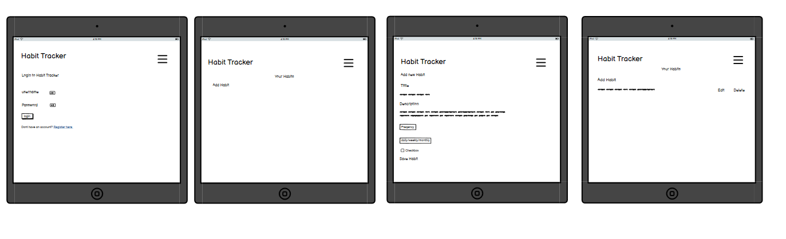
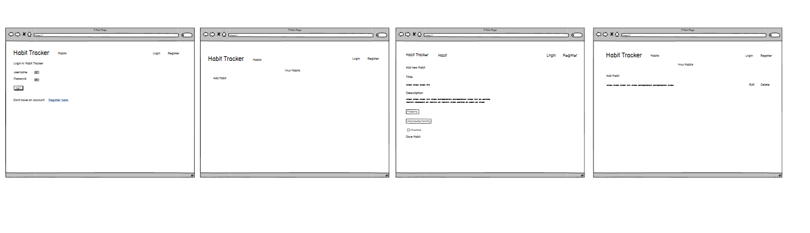
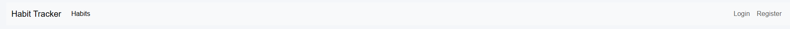
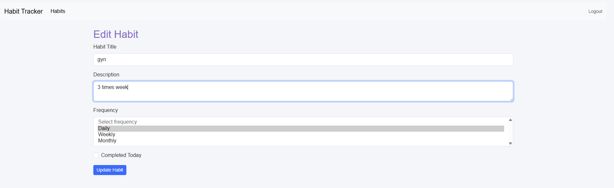

# Habit_Tracker

## Project Rationale

Habits Tracker is a web application made with Django that helps users keep track of, create, delete and look after their daily habits. User’s can add new habits, check there progress, tick off ones they’ve finished, edit any details that changed, and delete habits they don’t need anymore. Each user has their own private account so all their habit info stays personal and secure, without anyone else being able to see it. The whole idea was to make something simple that isn’t over complicated or confusing for people to use.

This app is mainly made for people who want to build better routines or just try get more organised in their day-to-day life. It works well for anyone who struggles keeping on top of habits, forgets what they planned to do, or just wants something simple to help keep them motivated.

## User Stories
- As  a user, I want to register so I can create an account and start tracking habits.

- As  a user, I want to login so I can access my personal dashboard.

- As  a user, I want to logout so my account stays secure.

- As  a user, I want to create a habit so I can track my daily routines.

- As  a user, I want to edit a habit to update its name or details.

- As  a user, I want to delete a habit if I no longer need it.

- As  a user, I want to mark a habit complete so I can track my progress.

## Wireframes

### Mobile Wireframes

Click here to view  the  Mobile  Wireframes

### Tablet Wireframes

Click here to view  the Tablet  Wireframes

### Desktop Wireframes

Click here to view  the Tablet  Wireframes

### Features
###  Existing Features
#### navbar:

-The navbar shows up at the top of every page so ppl can find their way around easier.
nav-links: 
Home (where the list of habits is)
Login / Register (only if the user isn’t signed in)
Logout (only shown when the user is logged in)

When someone logs in, the navbar “switches” so the login link switches to a logout button.

On mobile screens the navbar collapses down into a lil hamburger menu thanks to Bootstrap’s responsive classes (so it doesn’t take up the whole screen).

The logo/link of“Habit Tracker” always links back to the homepage.

Desktop navbar

#### home page
This page shows all the habits for the user who’s currently logged in n is responsive
each habit shows following:
-  A checkbox so you can tick it off for the day
- A  The habit title 
- An Edit button
- A Delete button

and an add Habit” button so users can quickly add a new habit.

#### EDIT Page
edit page allowing users to add a title, description frewuency and a completed today checkbox. submitting the form saves hbaut to user acc  directing them to homw page/ 

#### delete button
Users may delte habits from the home page via a red delete buton.

Habit deletion requiers confirmation via a dedicated delete rout, ensuring the user does not accidnetally remove a habit.

Only the habit owner is alowed to delete a habit 

## User Authentiaction (Login, Logout, Register)

Secure user authentiction is implemented using Django’s built-in forms.

Register Page

Allows new users to create an account

Automatically logs them in upon successful registration

Login Page

Uses Django AuthenticationForm

Provides error feedback for incorrect credentials

Logout

Ends the session and redirects users to the login page.

###  Future  Features
Habit Categories

- Group habits by type (health, work, personal) to keep things organized.

Dashboard Themes

- Light/dark mode or custom themes so users can pick what looks best.

Password Reset

- Users can reset forgotten passwords via an email link.

Two-Factor Auth

- Optional 2FA for extra security at login.

## Tools & Technologies Used

Click here to view the tools and technologies used table

| **Source**                  | **Link** |
|-----------------------------|----------|
| W3Schools - CSS             | [https://www.w3schools.com/css/](https://www.w3schools.com/css/) |
| W3Schools - HTML            | [https://www.w3schools.com/html/](https://www.w3schools.com/html/) |
| W3Schools - Python          | [https://www.w3schools.com/python/](https://www.w3schools.com/python/) |
| Bootstrap Docs              | [https://getbootstrap.com/docs/5.0/getting-started/introduction/](https://getbootstrap.com/docs/5.0/getting-started/introduction/) |
| Django Official Website     | [https://www.djangoproject.com/](https://www.djangoproject.com/) |
| SQLite Docs                 | [https://www.sqlite.org/](https://www.sqlite.org/) |
| Python Decouple             | [https://pypi.org/project/python-decouple/](https://pypi.org/project/python-decouple/) |
| Django Security             | [https://docs.djangoproject.com/en/stable/topics/security/](https://docs.djangoproject.com/en/stable/topics/security/) |
| Whitenoise Docs             | [http://whitenoise.evans.io/en/stable/](http://whitenoise.evans.io/en/stable/) |
| Render Platform             | [https://render.com/](https://render.com/) |
| GitHub                      | [https://github.com/](https://github.com/) |
| PyPI (Python Package Index) | [https://pip.pypa.io/](https://pip.pypa.io/) |
| Black Python Formatter      | [https://black.readthedocs.io/en/stable/](https://black.readthedocs.io/en/stable/) |

## Credits

Click here to view the credits table

| **Video**                                            | **Link** |
|------------------------------------------------------|----------|
| Django Tutorial - Full Course (FreeCodeCamp)         | [Watch here](https://www.youtube.com/watch?v=-tyBEsHSv7w) |
| Django for Beginners (Traversy Media)                | [Watch here](https://www.youtube.com/watch?v=HyN51x01Ve8) |
| Django Tutorial for Beginners (Tech With Tim)        | [Watch here](https://www.youtube.com/watch?v=uvISKB2ROrQ) |
| Django Full Course Playlist (Programming with Mosh)  | [Watch here](https://www.youtube.com/playlist?list=PL-osiE80TeTt2d9bfVyTiXJA-UTHn6WwU) |
| Django Forms Tutorial (Corey Schafer)                | [Watch here](https://www.youtube.com/watch?v=F5mRW0jo-U4) |
| Django Deployment with Heroku (Tech With Tim)        | [Watch here](https://www.youtube.com/watch?v=akXfF066MY0&t=20s) |
| Django Tutorial - Building a Blog (Python Engineer)  | [Watch here](https://www.youtube.com/watch?v=H_cWdD-aXCQ) |
| Django and Vue.js Tutorial (freeCodeCamp)            | [Watch here](https://www.youtube.com/watch?v=nXe4mZs1hHQ) |
| Django Authentication Tutorial (Tech With Tim)       | [Watch here](https://www.youtube.com/watch?v=qKS87S0Imsk) |
| Django API Tutorial (Real Python)                    | [Watch here](https://www.youtube.com/watch?v=vzBFJ3WEvOQ) |

## Database and Relationship

- The Habit Tracker app uses a relational databse.
- Every user can have many habits. 
- This is done by adding a foreign key in the Habit model: user = models.ForeignKey(User, on_delete=models.CASCADE).
- Every habit belongs to one user only.
- If a user is deletd, all of their habits get removed too, helping keep data integraty.
- Each habit has properties like:

  - title,  descrption,  frequency , whether it was completed today , streak count
, date it was created,.
This setup makes sure that data is stored consistantly and in a organized way., It also keeps the relationship between users and their habbits clear.

## Deployment

- The project is hosted on **Render**.  
- Render automatically installs all dependencies from `requirements.txt`.  
- The app runs using Render’s default Python web service settings.  
- Environment variables (e.g., `SECRET_KEY`, `DEBUG`) are configured in the Render dashboard.  
- [Live  link] (https://habit-tracker-2-wdwf.onrender.com/login/?next=/)

## Local deployment 

- Clone the repository  
  * git clone  (https://github.com/your-username/your-project.git)

- Change directory  
  * cd your-project

- Create a virtual environment:
  * **Windows:** python -m venv venv and then venv\Scripts\activate
  * **Mac/Linux:** python3 -m venv venv and then source venv/bin/activate

- Install dependencies  
  * pip install -r requirements.txt

- Apply migrations  
  * python manage.py migrate

- Run the server  
  * python manage.py runserver

- Open the link displayed in the terminal

## Forking the Repository

- Go to the repository on GitHub.  
- Click the **Fork** button in the top-right corner.  
- Select **Create Fork** and rename if desired.  
- Your forked copy will appear in your GitHub account.
