### HTML Validator

Click here to view the HTML Validator

| **Page**       | **Before** | **After** |
|----------------|------------|-----------|
| login.html     | 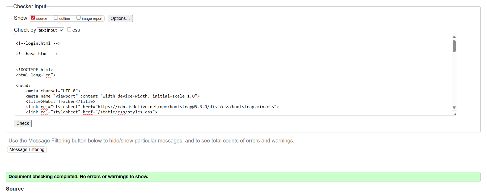 | No change |
| form.html      | 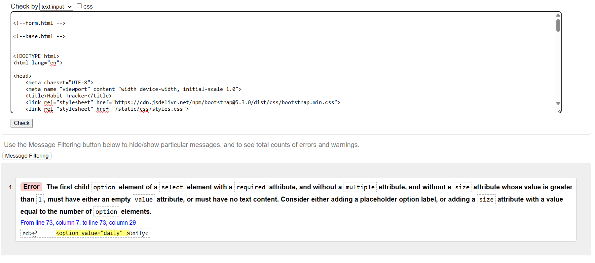 | 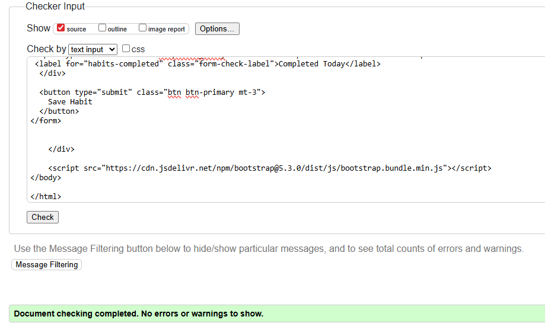 |
| register.html  |  | 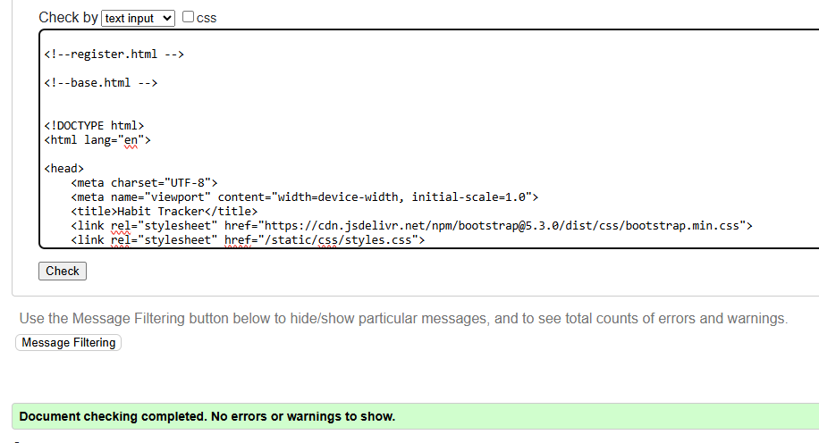 |

### CSS Validator

Click here to view the CSS Validator

| **Page** | **Before** | **After** |
|----------|------------|-----------|
| CSS      | 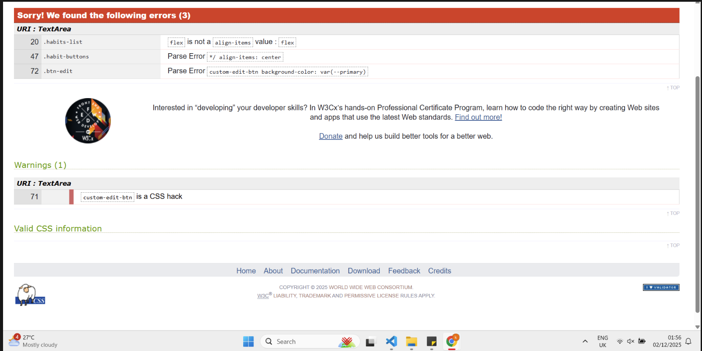 | 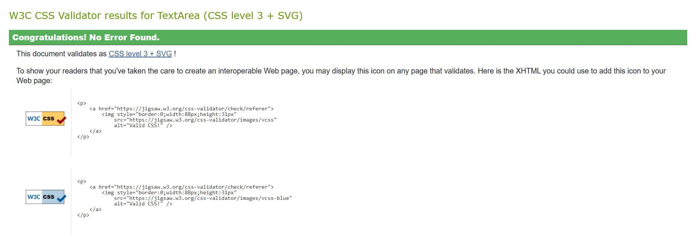 |

## Browser Performance

Brave

| Page | Screenshot |
|------|------------|
| Login  |  |
| Register  |  |
| Save Habit  |  |
| Edit/Delete  |  |

Chrome

| Page | Screenshot |
|------|------------|
| Login |  |
| Register |  |
| Save Habit |  |
| Edit/Delete Habit |  |

Opera

| Page | Screenshot |
|------|------------|
| Login  |  |
| Register  |  |
| Save Habit  |  |
| Edit/Delete Habit  |  |

Mozilla

| Page | Screenshot |
|------|------------|
| Login  |  |
| Register  |  |
| Save Habit  |  |
| Edit/Delete Habit  |  |

## Responsiveness

Click here to view responsiveness screenshots

| Responsiveness | Screenshot |
|----------------|------------|
| Mobile         |  |
| Tablet         |  |
| Laptop         |  |

## Lighthouse Audit

Click here to view the Lighthouse Audit

| **Lighthouse Audit** | **Screenshot** |
|----------------------|----------------|
| Mobile               |  |
| Laptop               | 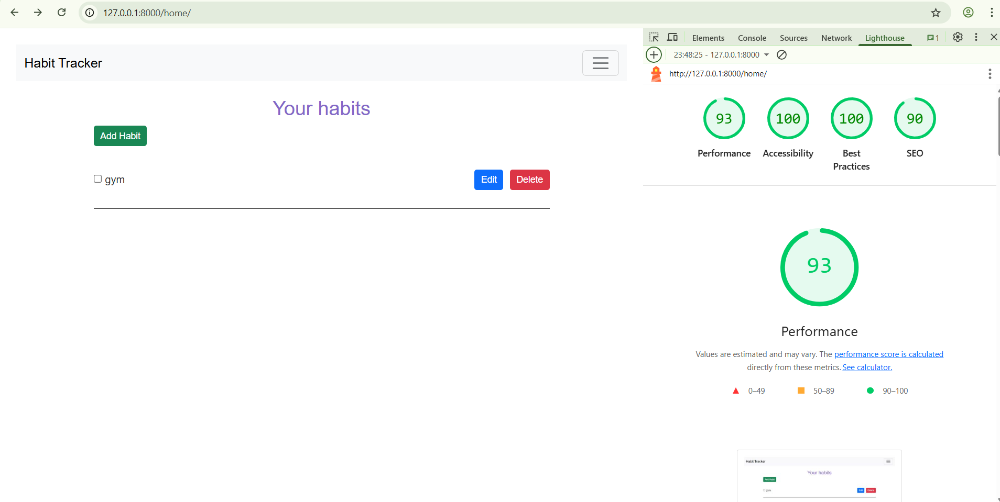 |

## User Story Testing

Click here to view the User Story Testing

| As a user I want to register so I can make account and start track my habits. | The user fill in the registration form (`register.html`) and make an account. If success, user is logged in and redirect to dashboard (`home`). Shows errors if something wrong. | 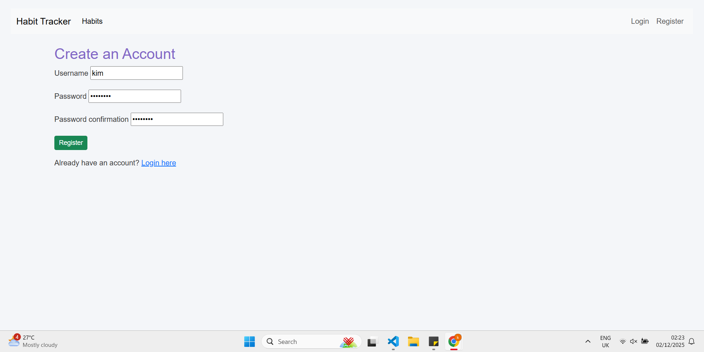 |
| As a user I want to login so I can go to my dashboard. | User put credentials in login form (`login.html`). If correct, user go to dashboard. Wrong credentials show error. | 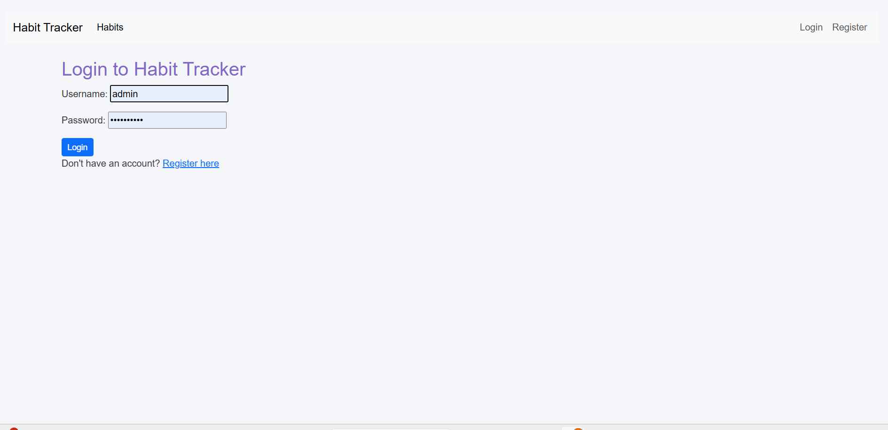 |
| As a user I want to logout so my account stay safe. | User click logout button in navbar. Session ends and user go back to login page. | 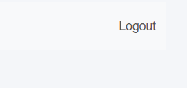 |
| As a user I want create a habit to track my daily routines. | User fill habit form (`form.html`) with title, description, frequency and done status. Habit save in database and show in dashboard. | 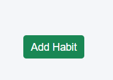 |
| As a user I want edit a habit to change name or info. | User edit existing habit and change details. Save changes in database and show in dashboard. | 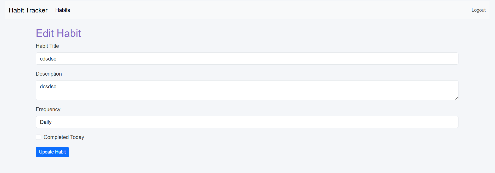 |
| As a user I want delete a habit if I dont need it. | User click delete button next to habit. Habit removed from database and gone from dashboard. | 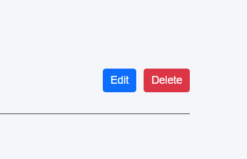 |

## Testing Existing Features

Click here to view the Feature Testing

| **Features** | **What was tested** | **Screenshot** |
|--------------|-------------------|----------------|
| Navbar       | User click links in navbar to go pages | 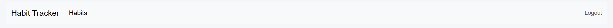 |
| Homepage     | User open home page | 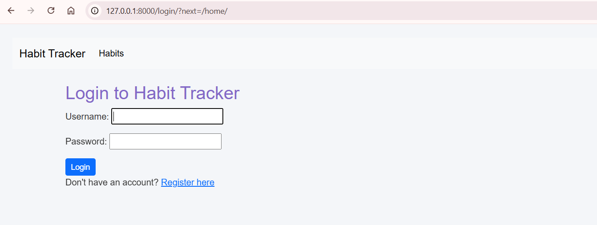 |
| Edit         | User change habit info and click save | 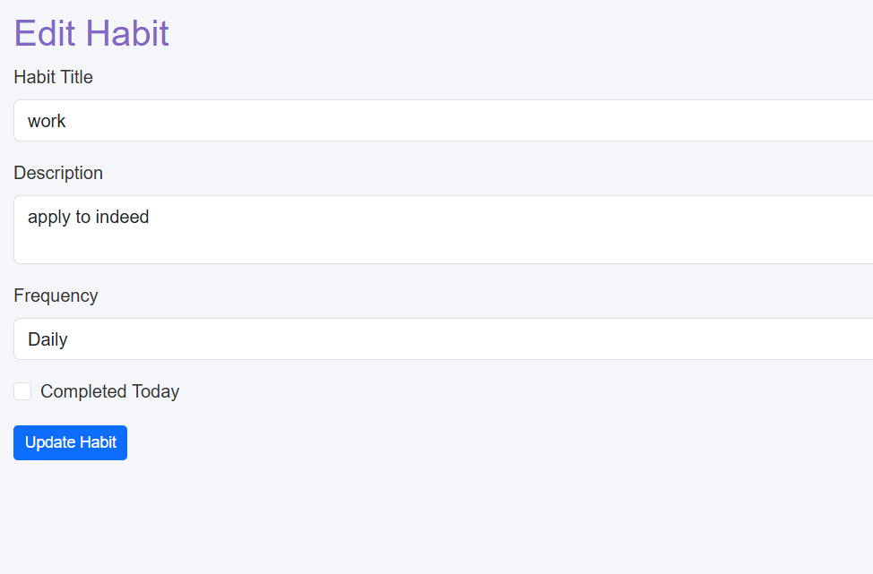 |
| Delete Button | User click delete next to habit | 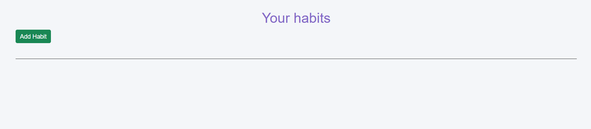 |
| Login        | User enter email and pass to login |  |
| Register     | User fill register form | 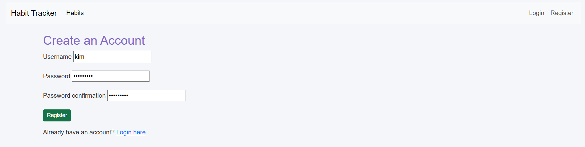 |
| Logout       | User click logout |  |

## CRUD Functionality Tests

Click here to view the CRUD Tests

| **Action** | **What User Does** | **Screenshot** |
|------------|------------------|----------------|
| Create     | User fill in habit form and click submit to add new habit |  |
| Edit       | User select existing habit, update info and open edit form |  |
| Save       | User edit habit and click save to update it in database |  |
| Delete     | User click delete button next to habit to remove it |  |
| Toggle     | User click "Completed Today" checkbox to mark habit done/undone |  |

## Bugs

Click here to view Bugs

| File         | What was wrong | How it was fixed |
|--------------|----------------|-----------------|
| form.html    | Django couldn't understand the if habit else in input fields. Form broke. | Changed code so input fields only show habit info if it exists. If no habit, fields stay empty. |
| index.html   |  gave error. Template tag maybe wrong or not inherited. | Fixed template so it extends base template properly and all  tags closed. |
| homepage.html | Habits not showing.  not working or view didn't pass habits. | Made sure view sends habits to template and loop show them correctly. |
| base.html    | Django couldn't find URL pattern named task_create. | Added URL in urls.py called task_create to link to right view. |
| init__.py    | Django expected number but got SimpleLazyObject (AnonymousUser). Crash happened. | Added check so code only use user info if logged in. Anonymous users don't break it. |

## Unfixed Bugs

No bugs found to my knowledge.